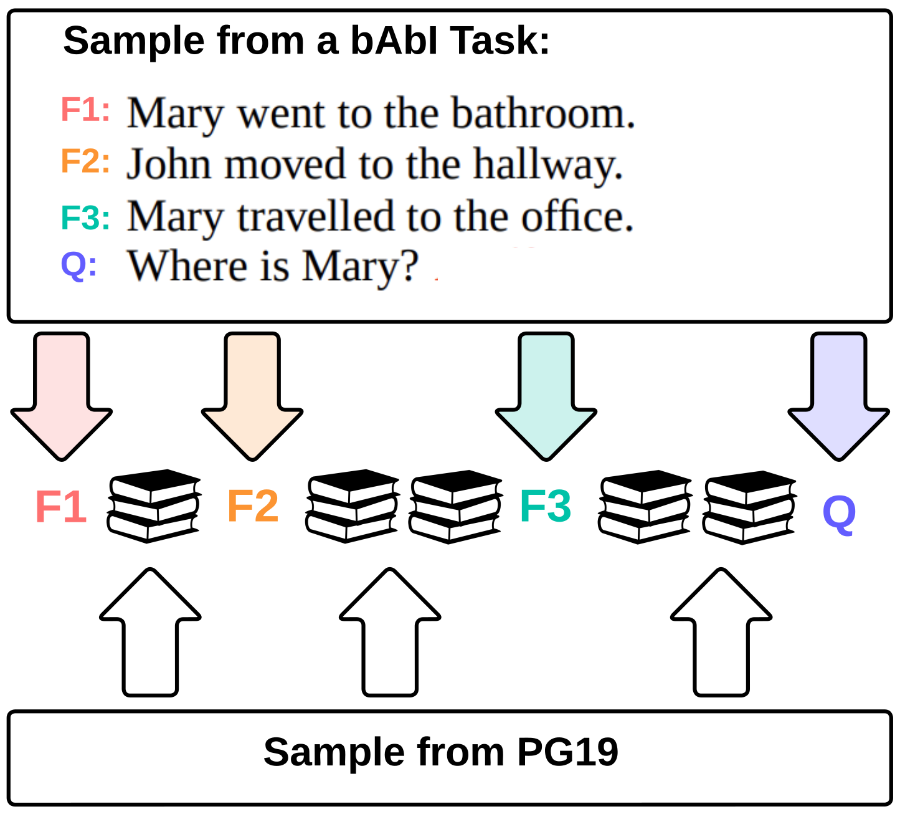
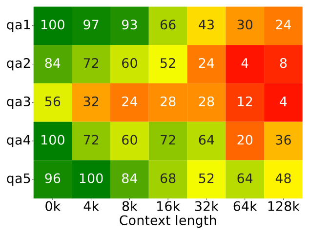
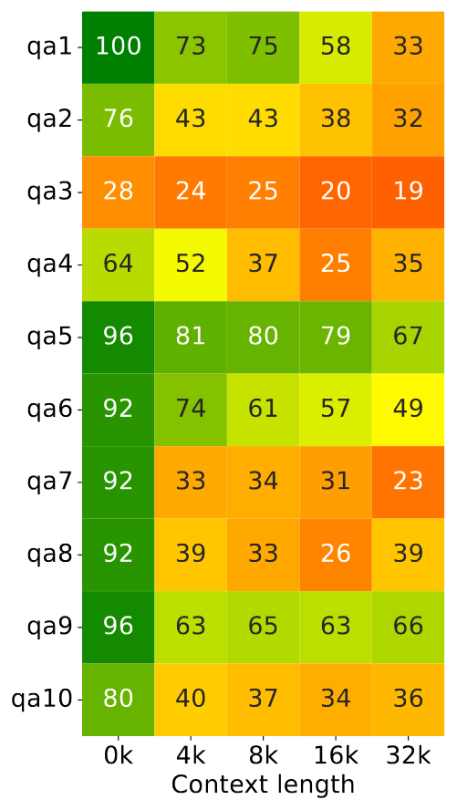
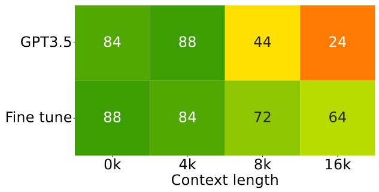
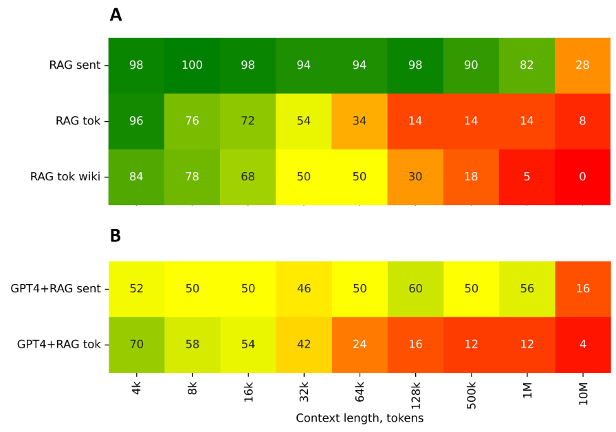

# BABILong: a long-context needle-in-a-haystack benchmark for LLMs

Preprint is on [arXiv](https://arxiv.org/abs/2402.10790)

## bAbI + Books = BABILong

**BABILong** is a novel generative benchmark for evaluating the performance of NLP models in
processing arbitrarily long documents with distributed facts.

Solving tasks with a long context size requires the model to distinguish important information from large amounts of irrelevant details. To simulate this behavior we ”hide” the sentences of the original task between the sentences of irrelevant text. We use the [bAbI](https://huggingface.co/datasets/facebook/babi_qa) dataset [1] as facts and [PG19](https://huggingface.co/datasets/pg19) as background text. Resulting test samples might have lenghts of **millions of tokens**.



BABILong consists of 20 tasks designed for evaluation of basic aspects of reasoning. The bAbI tasks are generated by simulating a set of characters and objects engaged in various movements and interactions with each other in multiple locations. Each interaction is represented by a fact, e.g. **”Mary travelled to the office”**, and the task is to answer a question using the facts from the current simulation, for instance, **”Where is Mary?”**. The bAbI tasks vary based on the number of facts, question complexity and the aspects of reasoning.

### First ten tasks of BABILong

 | Task | Name                     | min facts per task | max facts per task |
|------|--------------------------|--------------------|--------------------|
| qa1  | single supporting fact   | 2                  | 10                 |
| qa2  | two supporting facts     | 2                  | 68                 |
| qa3  | three supporting facts   | 4                  | 320                |
| qa4  | two arg relations        | 2                  | 2                  |
| qa5  | three arg relations      | 2                  | 126                |
| qa6  | yes-no questions         | 2                  | 26                 |
| qa7  | counting                 | 2                  | 52                 |
| qa8  | lists-sets               | 2                  | 50                 |
| qa9  | simple negation          | 2                  | 10                 |
| qa10 | indefinite knowledge     | 2                  | 10                 |

### Play with dataset

 [](https://colab.research.google.com/github/booydar/babilong/blob/main/notebooks/babilong_usage_example.ipynb) [BABILong notebook](https://github.com/booydar/babilong/blob/main/notebooks/babilong_usage_example.ipynb)

 ## Preliminary evaluation results

### GPT-4 fails to solve needle in a haystack tasks for 75% of available context window



 Every row shows accuracy in % of solving corresponding BABILong task ('qa1'-'qa5') and every column corresponds to the task size submitted to GPT4-Turbo with 128K context window. All values are averages of 25 samples.

### Mistral performance scales only for some tasks but  but quickly degenerates for majority of others as context grow



Every row shows accuracy in % of solving corresponding BABILong task ('qa1'-'qa10') and every column corresponds to the task size submitted to Mistarl-Medium with 32K context window. All values are averages of 25 samples.

### Fine-tuning of GPT-3.5 improves search of supporting facts in medium context size



Every row shows accuracy in % for GPT-3.5 before and after fine-tuning via API with 100 samples on 'qa1' task. Every column corresponds to the task size. All values are averages of 25 samples.

### Retrieval augmentation does not help to solve needle in a haystack QA task



**A** Retrieval does the job if embeddings match fact size. The figure shows recall@5 scores of a retrieval RAG component on 'qa1' task for the given size for sentences (sent) and text pieces of 512 tokens (tok). 

**B** Accuracy in % by GPT4 based RAG. All values are averages of 50 samples.

### Evaluate your favorite LLM on BABILong

[](https://colab.research.google.com/github/booydar/babilong/blob/main/notebooks/demo_llm.ipynb) [Evaluate your long-context model](https://github.com/booydar/babilong/blob/main/notebooks/demo_llm.ipynb)


## Join the Challenge: Help Build the BABILong LLM Leaderboard!

We are excited to invite the community to participate in expanding the BABILong benchmark, a vital tool for assessing the capabilities of Large Language Models (LLMs) in processing and understanding long-context information. Your contribution can help in creating a comprehensive leaderboard that reflects the current state and progress in the field of NLP.

### How You Can Contribute

- **Test Your Models:** Use BABILong to evaluate your own LLMs. Share your findings and help us understand how different models perform on complex, long-context tasks.
- **Share Insights:** If you've conducted experiments or have insights on improving LLMs' performance on BABILong tasks, we'd love to hear from you.
- **Develop New Tasks:** Enhance the benchmark by contributing new tasks that challenge and push the boundaries of current NLP technologies.
- **Improve the Benchmark:** Suggestions for improving BABILong's design, methodology, or documentation are always welcome.
- **Spread the Word:** Help us reach a wider audience. Share this benchmark within your network and encourage others to participate.

### Submitting Your Results

To submit your results or contributions, please follow these steps:

1. **Prepare Your Data:** Ensure your results are well-documented, including model details, context size, and any specific configurations or fine-tuning applied.
2. **Create a Pull Request:** Submit your results or contributions via a pull request to the [BABILong GitHub repository](https://github.com/booydar/babilong).
3. **Documentation:** Include a clear description of your submission and any relevant details that can help in the review process.

By participating, you're not only contributing to the advancement of NLP research but also helping to shape the future of language models' capabilities in handling real-world, complex, long-form content. Let's collaborate to make BABILong a cornerstone for benchmarking the next generation of LLMs!

Join us in this exciting endeavor and let's push the boundaries of what's possible together!

## Citation
```
@misc{kuratov2024search,
      title={In Search of Needles in a 10M Haystack: Recurrent Memory Finds What LLMs Miss}, 
      author={Yuri Kuratov and Aydar Bulatov and Petr Anokhin and Dmitry Sorokin and Artyom Sorokin and Mikhail Burtsev},
      year={2024},
      eprint={2402.10790},
      archivePrefix={arXiv},
      primaryClass={cs.CL}
}
```

## References

[1] Weston, Jason, et al. "Towards ai-complete question answering: A set of prerequisite toy tasks." arXiv preprint [arXiv:1502.05698](https://arxiv.org/abs/1502.05698) (2015).
