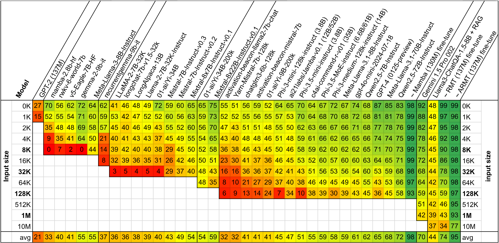

# BABILong: a long-context needle-in-a-haystack benchmark for LLMs

Preprint is on [arXiv](https://arxiv.org/abs/2406.10149).

Evaluation sets of BABILong on HF Datasets: [100 samples](https://huggingface.co/datasets/RMT-team/babilong) and [1000 samples](https://huggingface.co/datasets/RMT-team/babilong-1k-samples) per task and per length (0, 1, 2, 4, 8, 16, 32, 64, 128, 256, 512k, 1M and 10M).

[BABILong Leaderboard](https://huggingface.co/spaces/RMT-team/babilong) on Hugging Face.

This work was done in collaboration of AIRI, DeepPavlov.ai, and London Institute for Mathematical Sciences.

## bAbI + Books = BABILong

**BABILong** is a novel generative benchmark for evaluating the performance of NLP models in
processing arbitrarily long documents with distributed facts.

Solving tasks with a long context size requires the model to distinguish important information from large amounts of irrelevant details. To simulate this behavior we ”hide” the sentences of the original task between the sentences of irrelevant text. We use the [bAbI](https://huggingface.co/datasets/facebook/babi_qa) dataset [1] as facts and [PG19](https://huggingface.co/datasets/pg19) [2] as background text. Resulting test samples might have lenghts of **millions of tokens**.


BABILong consists of 20 tasks designed for evaluation of basic aspects of reasoning. The bAbI tasks are generated by simulating a set of characters and objects engaged in various movements and interactions with each other in multiple locations. Each interaction is represented by a fact, e.g. **”Mary travelled to the office”**, and the task is to answer a question using the facts from the current simulation, for instance, **”Where is Mary?”**. The bAbI tasks vary based on the number of facts, question complexity and the aspects of reasoning.

### First ten tasks of BABILong

 | Task | Name                     | facts per task | supporting facts per task |
|------|--------------------------|-----------------|---------------------------|
| qa1  | single supporting fact   | 2 - 10          | 1                         |
| qa2  | two supporting facts     | 2 - 68          | 2                         |
| qa3  | three supporting facts   | 4 - 32          | 3                         |
| qa4  | two arg relations        | 2               | 1                         |
| qa5  | three arg relations      | 2 - 126         | 1                         |
| qa6  | yes-no questions         | 2 - 26          | 1                         |
| qa7  | counting                 | 2 - 52          | 1-10                      |
| qa8  | lists-sets               | 2 - 50          | 1-8                       |
| qa9  | simple negation          | 2 - 10          | 1                         |
| qa10 | indefinite knowledge     | 2 - 10          | 1                         |

### Play with dataset

 [](https://colab.research.google.com/github/booydar/babilong/blob/main/notebooks/babilong_usage_example.ipynb) [BABILong notebook](https://github.com/booydar/babilong/blob/main/notebooks/babilong_usage_example.ipynb)

 ## LLM evaluation results




We have included long-context models with the highest number of
monthly downloads from the Hugging Face platform in our evaluation. Values represent average accuracy over QA1-QA5 tasks from BABILong.

### BABILong is a challenging benchmark for current long-context models.

Even models that claim to support 128K tokens, such as GPT-4 (gpt-4-0125-preview) experience degradation beyond 10\% of their input capacity. RAG methods do not help, while fine-tuning of small scale models (RMT 137M and Mamba 130M) shows that the tasks are solvable.


### Evaluate your favorite LLM on BABILong

Examples for evaluation of popular LLMs are provided in the `./notebooks` and `./scripts` folders.

- [](https://colab.research.google.com/github/booydar/babilong/blob/main/notebooks/babilong_evaluation_example.ipynb)  [Example how to evaluate models on BABILong](https://github.com/booydar/babilong/blob/main/notebooks/babilong_evaluation_example.ipynb)


### Train your model on BABILong

- [](https://colab.research.google.com/github/booydar/babilong/blob/main/notebooks/demo_llm.ipynb) [Train your long-context model](https://github.com/booydar/babilong/blob/main/notebooks/demo_llm.ipynb)

You can generate training samples using the README in `./data`.

Predictions of various LLMs that we evaluated on BABILong (GPT-4, GPT-3.5, Mistral, Mixtral, Phi-3, ChatGLM, Yi, Jamba) are in [predictions_06_2024](https://github.com/booydar/babilong/tree/predictions_06_2024) branch.

## Join the Challenge: Help Build the BABILong LLM Leaderboard!

We are excited to invite the community to participate in expanding the BABILong benchmark, a vital tool for assessing the capabilities of Large Language Models (LLMs) in processing and understanding long-context information. Your contribution can help in creating a comprehensive leaderboard that reflects the current state and progress in the field of NLP.

### How You Can Contribute

- **Test Your Models:** Use BABILong to evaluate your own LLMs. Share your findings and help us understand how different models perform on complex, long-context tasks.
- **Share Insights:** If you've conducted experiments or have insights on improving LLMs' performance on BABILong tasks, we'd love to hear from you.
- **Develop New Tasks:** Enhance the benchmark by contributing new tasks that challenge and push the boundaries of current NLP technologies.
- **Improve the Benchmark:** Suggestions for improving BABILong's design, methodology, or documentation are always welcome.
- **Spread the Word:** Help us reach a wider audience. Share this benchmark within your network and encourage others to participate.

### Submitting Your Results

To submit your results or contributions, please follow these steps:

1. **Prepare Your Data:** Ensure your results are well-documented, including model details, context size, and any specific configurations or fine-tuning applied.
2. **Create a Pull Request:** Submit your results or contributions via a pull request to the [BABILong GitHub repository](https://github.com/booydar/babilong).
3. **Documentation:** Include a clear description of your submission and any relevant details that can help in the review process.

By participating, you're not only contributing to the advancement of NLP research but also helping to shape the future of language models' capabilities in handling real-world, complex, long-form content. Let's collaborate to make BABILong a cornerstone for benchmarking the next generation of LLMs!

Join us in this exciting endeavor and let's push the boundaries of what's possible together!

## Citation
```
@misc{kuratov2024babilong,
      title={BABILong: Testing the Limits of LLMs with Long Context Reasoning-in-a-Haystack}, 
      author={Yuri Kuratov and Aydar Bulatov and Petr Anokhin and Ivan Rodkin and Dmitry Sorokin and Artyom Sorokin and Mikhail Burtsev},
      year={2024},
      eprint={2406.10149},
      archivePrefix={arXiv},
      primaryClass={id='cs.CL' full_name='Computation and Language' is_active=True alt_name='cmp-lg' in_archive='cs' is_general=False description='Covers natural language processing. Roughly includes material in ACM Subject Class I.2.7. Note that work on artificial languages (programming languages, logics, formal systems) that does not explicitly address natural-language issues broadly construed (natural-language processing, computational linguistics, speech, text retrieval, etc.) is not appropriate for this area.'}
}
```

```
@misc{kuratov2024search,
      title={In Search of Needles in a 10M Haystack: Recurrent Memory Finds What LLMs Miss}, 
      author={Yuri Kuratov and Aydar Bulatov and Petr Anokhin and Dmitry Sorokin and Artyom Sorokin and Mikhail Burtsev},
      year={2024},
      eprint={2402.10790},
      archivePrefix={arXiv},
      primaryClass={cs.CL}
}
```

## Dataset Metadata

The following table is necessary for this dataset to be indexed by search
engines such as <a href="https://g.co/datasetsearch">Google Dataset Search</a>.
<div itemscope itemtype="http://schema.org/Dataset">
<table>
  <tr>
    <th>property</th>
    <th>value</th>
  </tr>
  <tr>
    <td>name</td>
    <td><code itemprop="name">The BABILong Benchmark</code></td>
  </tr>
  <tr>
    <td>alternateName</td>
    <td><code itemprop="alternateName">BABILong</code></td>
  </tr>
  <tr>
    <td>url</td>
    <td><code itemprop="url">https://github.com/booydar/babilong</code></td>
  </tr>
  <tr>
    <td>sameAs</td>
    <td><code itemprop="sameAs">https://github.com/booydar/babilong</code></td>
  </tr>
  <tr>
    <td>description</td>
    <td><code itemprop="description">This repository contains code and instructions for BABILong benchmark. The BABILong benchmark is designed to test language models' ability to reason across facts distributed in extremely long documents. BABILong includes a diverse set of 20 reasoning tasks, including fact chaining, simple induction, deduction, counting, and handling lists/sets. BABILong uses tasks with facts and questions from bAbI. PG-19 books are used as source of long natural contexts.</code></td>
  </tr>
  <tr>
    <td>license</td>
    <td>
      <div itemscope itemtype="http://schema.org/CreativeWork" itemprop="license">
        <table>
          <tr>
            <th>property</th>
            <th>value</th>
          </tr>
          <tr>
            <td>name</td>
            <td><code itemprop="name">Apache License, Version 2.0</code></td>
          </tr>
          <tr>
            <td>url</td>
            <td><code itemprop="url">https://www.apache.org/licenses/LICENSE-2.0.html</code></td>
          </tr>
        </table>
      </div>
    </td>
  </tr>
  <tr>
    <td>citation</td>
    <td><code itemprop="citation">https://identifiers.org/arxiv:2402.10790</code></td>
  </tr>
</table>
</div>

## References

[1] Weston, Jason, et al. "Towards ai-complete question answering: A set of prerequisite toy tasks." arXiv preprint [arXiv:1502.05698](https://arxiv.org/abs/1502.05698) (2015).

[2] Rae, Jack W., et al. "Compressive Transformers for Long-Range Sequence Modelling." International Conference on Learning Representations. 2019.

## License

Our code is released under the Apache 2.0 License. We use data from the PG-19 corpora (Rae et al., 2020) ([Apache 2.0 License](https://github.com/google-deepmind/pg19/blob/master/LICENSE)) and the bAbI dataset (Weston et al., 2016) ([BSD License](https://github.com/facebookarchive/bAbI-tasks/blob/master/LICENSE.md)).
